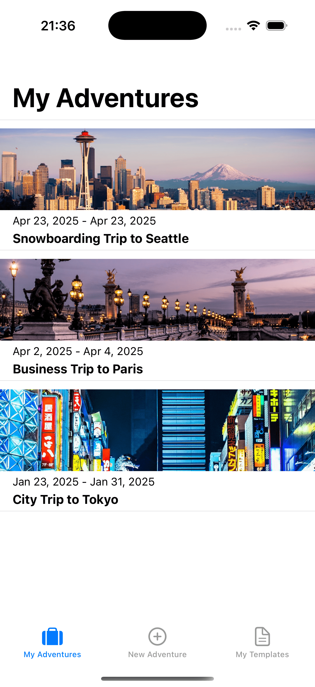

# Adventure Checklist

## Screenshots

*My Adventures - View and manage your adventure checklists*

*New Adventure - Create a new adventure with customizable options*

*My Templates - Access and use pre-made checklist templates*

## Table of Contents

1. [Overview](#Overview)
2. [Product Spec](#Product-Spec)
3. [Wireframes](#Wireframes)
4. [Schema](#Schema)

## Overview

### Description

Adventure Checklist is a travel planning app that helps users organize their packing lists for different types of trips. Users can create custom checklists for various adventures, use pre-made templates, and track their packing progress. The app supports different trip types (camping, snowboarding, city, business) and handles both domestic and international travel needs.

### App Evaluation

- **Category:** Travel / Productivity
- **Mobile:** The app is designed for mobile use, allowing users to access their checklists on the go while packing or traveling.
- **Story:** Helps travelers stay organized and ensure they don't forget essential items for their trips.
- **Market:** Targeted at frequent travelers, vacation planners, and anyone who wants to stay organized while packing.
- **Habit:** Users can create and manage multiple checklists, with the app encouraging regular use before and during trips.
- **Scope:** Focused on checklist management with room to expand into additional travel planning features.

## Product Spec

### 1. User Stories (Required and Optional)

**Required Must-have Stories**

* User can create a new adventure with destination, dates, and trip type
* User can view and manage their adventures
* User can create and use templates for common trip types
* User can add, check, and delete items from checklists
* User can see packing progress with a progress bar
* User can save checklists as templates for future use

**Optional Nice-to-have Stories**

* User can add notes to checklist items
* User can categorize items (clothing, electronics, etc.)
* User can set reminders for packing deadlines
* User can add photos to checklist items

### 2. Screen Archetypes

- [ ] New Adventure Screen
* User can enter trip details
* User can select trip type
* User can choose to use a template
* User can set dates

- [ ] My Adventures Screen
* User can view list of their adventures
* User can select an adventure to view/edit
* User can see basic trip info for each adventure

- [ ] Checklist Screen
* User can view and manage checklist items
* User can check/uncheck items
* User can add new items
* User can delete items
* User can see packing progress

- [ ] My Templates Screen
* User can view their saved templates
* User can create new templates from adventures
* User can use templates for new adventures

### 3. Navigation

**Tab Navigation** (Tab to Screen)

* New Adventure
* My Adventures
* My Templates

**Flow Navigation** (Screen to Screen)

- [ ] New Adventure Screen
* Create -> My Adventures (after saving)
* Cancel -> My Adventures

- [ ] My Adventures Screen
* Select Adventure -> Checklist Screen
* Create New -> New Adventure Screen

- [ ] Checklist Screen
* Back -> Previous Screen
* Save as Template -> My Templates

- [ ] My Templates Screen
* Select Template -> Checklist Screen
* Back -> Previous Screen

## Schema 

### Models

#### Adventure
| Property | Type | Description |
| -------- | -------- | -------- |
| id | String | Unique identifier |
| name | String | Adventure name |
| destination | String | Trip destination |
| startDate | Date | Trip start date |
| endDate | Date | Trip end date |
| tripType | String | Type of trip (camping, snowboarding, etc.) |
| isInternational | Boolean | Whether trip is international |
| checklistItems | [ChecklistItem] | List of items to pack |

#### Template
| Property | Type | Description |
| -------- | -------- | -------- |
| id | String | Unique identifier |
| name | String | Template name |
| tripType | String | Type of trip |
| checklistItems | [ChecklistItem] | List of default items |

#### ChecklistItem
| Property | Type | Description |
| -------- | -------- | -------- |
| name | String | Item name |
| isChecked | Boolean | Whether item is packed |

### Schema Diagram

### Data Persistence

The app uses UserDefaults to store:
- List of adventures
- List of templates
- Default templates for different trip types

All data is stored locally on the device. 

## Video Walkthrough

    

